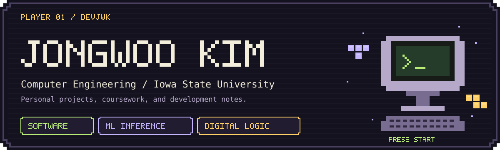
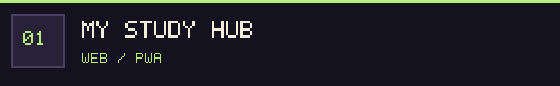
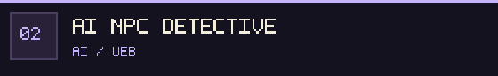
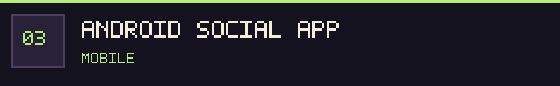
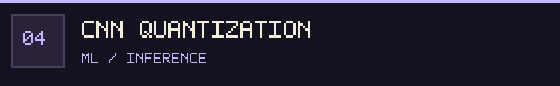
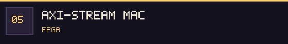
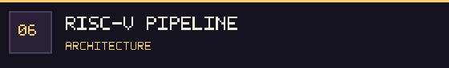

  

  Computer Engineering student at <b>Iowa State University</b>. 
  Android &amp; web applications · CNN inference · FPGA &amp; processor design

  
  
  

---

### > PLAYER PROFILE

Hi, I'm **Jongwoo Kim / 김종우**. My work spans software applications, machine learning inference, and digital hardware. This profile collects my personal projects and coursework, with notes on **my contributions, results, and what still needs work**.

## Stage select

`01–03 / APPLICATIONS` · `04 / MACHINE LEARNING` · `05–06 / DIGITAL HARDWARE`

<table>
<tr>
<td width="50%" valign="top">

PERSONAL PROJECT · WEB / PWA

A Korean study planner that brings tasks, a pomodoro timer, flashcards, and retrospectives together.

<b>My work:</b> Planning, interface design, vanilla JavaScript implementation, browser storage, and offline support.

<code>JavaScript</code> <code>Service Worker</code> <code>localStorage</code>

<a href="https://github.com/devjwk/my-study-hub"><b>▸ OPEN REPOSITORY</b></a>

</td>
<td width="50%" valign="top">

PERSONAL PROJECT · AI / WEB

A mystery game where players collect clues and question AI-powered NPCs.

<b>My work:</b> Game state machine, dialogue validation, conversation memory, and a metrics dashboard.

<code>Next.js</code> <code>TypeScript</code> <code>OpenAI API</code>

<a href="https://github.com/devjwk/ai-npc-detective-game"><b>▸ OPEN REPOSITORY</b></a> Single-episode MVP · sessions stored in memory

</td>
</tr>
<tr>
<td width="50%" valign="top">

TEAM PROJECT · MOBILE

A four-person Android and Spring Boot project for finding people and interest-based groups.

<b>My work:</b> Android frontend for groups, recommendations, notifications, moderation, admin flows, and system tests.

<code>Java</code> <code>Android</code> <code>Volley</code> <code>WebSocket</code>

<a href="https://github.com/devjwk/coms3090-2_sc_2"><b>▸ OPEN REPOSITORY</b></a>

</td>
<td width="50%" valign="top">

COURSE PROJECT · ML / INFERENCE

Comparing floating-point, 8-bit, 4-bit, and 2-bit CNN inference.

<b>My work:</b> Quantization export, the C++ integer inference path, and evaluation of accuracy, storage, and latency.

<code>C++</code> <code>Python</code> <code>TensorFlow</code>

<a href="https://github.com/devjwk/cpre487lab4"><b>▸ OPEN REPOSITORY</b></a>

</td>
</tr>
<tr>
<td width="50%" valign="top">

TEAM COURSE PROJECT · FPGA

Staged and pipelined multiply-accumulate units for convolution.

<b>My work:</b> Eight-case board test with timing, simulation and synthesis re-runs, and performance and bottleneck analysis.

<code>VHDL</code> <code>Vivado / Vitis</code> <code>ZedBoard</code>

<a href="https://github.com/devjwk/cpre487lab3"><b>▸ OPEN REPOSITORY</b></a>

</td>
<td width="50%" valign="top">

TEAM COURSE PROJECT · COMPUTER ARCHITECTURE

A two-person processor design project with hardware hazard handling.

<b>My work:</b> Forwarding, hazard handling, pipeline registers, module testbenches, and benchmarks.

<code>VHDL</code> <code>QuestaSim</code> <code>Quartus</code>

<a href="https://github.com/devjwk/Project-Part-1"><b>▸ OPEN REPOSITORY</b></a>

</td>
</tr>
</table>

## Tech inventory

`EQUIPMENT / TOOLS USED IN THE PROJECTS ABOVE`

**Applications**

  
  
  
  
  

**Machine learning &amp; inference**

  
  
  

**Digital hardware**

  
  
  
  

**Workflow:** Git · GitLab CI/CD · Espresso/JUnit · simulation and synthesis reports

## Quest log

`ACTIVE QUEST / FPGA TETRIS`

### [FPGA Tetris](https://github.com/devjwk/fpga-tetris)

Building a hardware-only game on ZedBoard, starting with VGA timing and an RGB test pattern.

| Current stage | Next steps |
| --- | --- |
| VGA foundation — synthesis and implementation | Verify monitor output, then add button input and game logic |

---

<b>▸ LANGUAGE / 한국어</b>

 

안녕하세요, Iowa State University에서 Computer Engineering을 전공하는 김종우입니다. Android·웹 개발, CNN 추론과 양자화, FPGA·프로세서 설계 프로젝트를 진행해왔습니다.

각 저장소에는 제가 맡은 부분과 구현 과정, 확인한 결과, 남은 과제를 정리했습니다. 개인 프로젝트와 팀 프로젝트를 통해 쌓아가는 개발 경험을 이곳에 기록합니다.

  Jongwoo Kim · devjwk · Iowa State University

